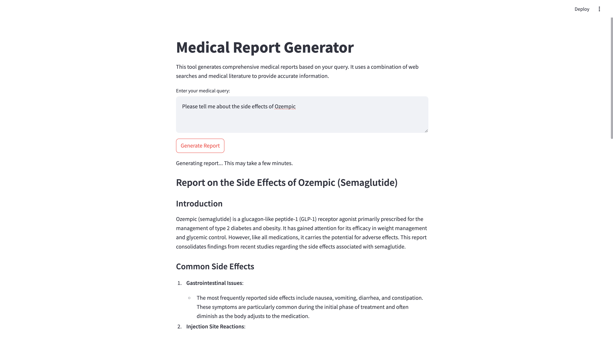

 # Medical Report Generator with Multi-Agent System

This project utilizes a multi-agent system to produce detailed medical reports based on user queries. The system includes a Streamlit-based front-end for user interaction and an agent-based back-end that processes queries to generate the desired reports.

## Table of Contents

- [Features](#features)
- [Architecture](#architecture)
- [Installation](#installation)
- [Usage](#usage)
- [Screenshot](#screenshot)
- [Technologies Used](#technologies-used)
- [License](#license)

## Features

- **Multi-Agent System**: Uses multiple specialized agents to process and analyze medical queries.
- **Streamlit Front-End**: Interactive and user-friendly interface for entering queries and viewing reports.
- **Automated Report Generation**: Dynamically generates detailed medical reports based on input.

## Architecture

1. **Front-End**: A Streamlit-based application for user interaction.
2. **Back-End**: A multi-agent system implemented using LangGraph that collaborates to perform medical research using the internet via DuckDuckGo Search and literature on PubMed, and generates medical reports.
3. **Report Display**: Reports are displayed on the front-end for user review.

## Installation

To run the project locally, follow these steps:

1. Clone this repository:

   ```bash
   git clone https://github.com/your-repo/medical-report-generator.git
   cd medical-report-generator

2. Install dependencies:

    ```bash
    pip install -r requirements.txt

3. Run the Streamlit app:

    ```bash
    streamlit run app.py

## Usage

1. Start the application using the command above.
2. Enter a query in the provided text input box in the front-end.
3. Wait for the system to process your query.
4. View the generated medical report directly in the interface.

## Screenshot

Below is a screenshot of the Streamlit front-end:




